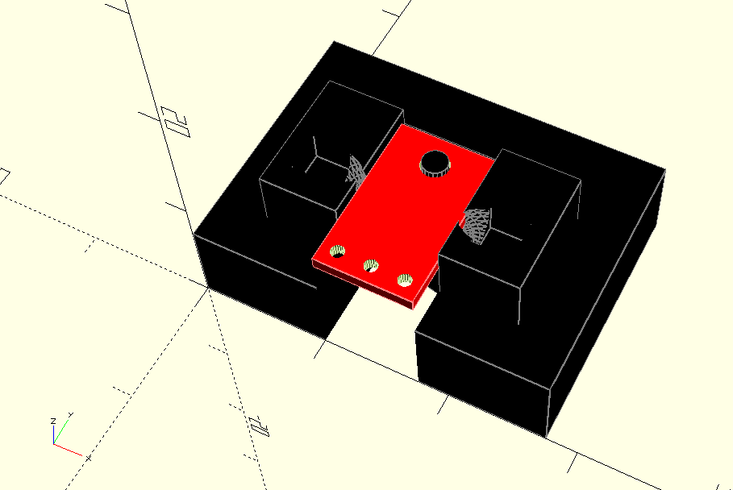
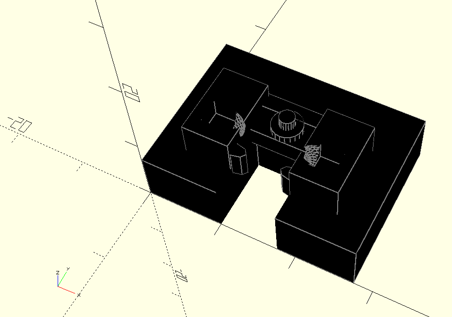

# Support for Pololu PQTR-1A  Refective Sensor

The Pololu QTR-1A refective sensor from Pololu is a very small breakout board containing a QRE1113GR SMT. I have designed a 
support that will hold the sensor on the board 8 mm from a reflective surface. This is the distance used on the 
Pololu 3Pi robot. The combination of the board and support should allow the students to investigate the techniques used 
to read the sensor employed by the robot.

## Images of different views

### 3D viewer of STL

Github incorperates an interactive 3D viewer for STL files.

* [support-r-sensor.stl](support-r-sensor.stl)

## OpenSCAD file

The OpenSCAD file used to generate the other files is here:

* [support-r-sensor.scad](support-r-sensor.scad)
