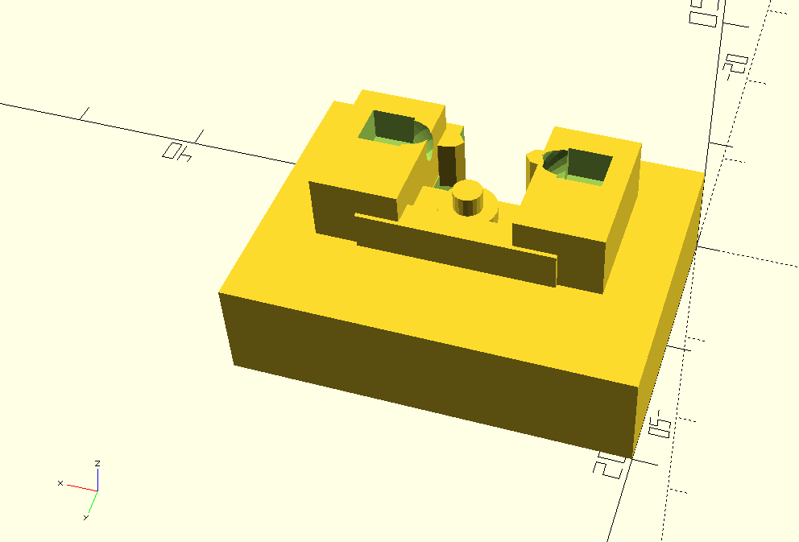

# Support for Pololu PQTR-1A  Reflective Sensor

The Pololu QTR-1A reflective sensor from Pololu is a very small breakout board containing a QRE1113GR SMT. I have designed a 
support that will hold the sensor on the board 8 mm from a reflective surface. This is the distance used on the 
Pololu 3Pi robot. The combination of the board and support should allow the students to investigate the techniques used 
to read the sensor employed by the robot.

## Channels Added

This branch differs from the master branch in that channels have been added to the support piece. 

* Two channels on top to insert hot glue into to hold the board down.
* One channel on the bottom so that material can be added underneath if desired to add mass.

## Images of different views

* virtual view 1

* real view 1

* virtual view 2

* real view 2

* sensor over tape

* virtual view 3

* real view 3

### 3D viewer of STL

Github incorperates an interactive 3D viewer for STL files.

* [support-r-sensor-ch.stl](support-r-sensor-ch.stl)

## OpenSCAD file

The OpenSCAD file used to generate the other files is here:

* [support-r-sensor-ch.scad](support-r-sensor-ch.scad)

One can preview what the sensor board looks like on the support if the following line in the SCAD file is uncommitted
and then the preview is obtained from OpenSCAD.

~~~~scad
// translate([10, 0, 0.2]) sensor_board();
~~~~

